# Content

- [MH-COST-A](#mh-cost-a)
- [MH-COST-V](#mh-cost-v)
- [MH-OBS](#mh-obs)
- [MH-SEC](#mh-sec)
- [Project Recap](#project-recap)


# Cover
## 1. Group: 15
## 2. Members:
- Phạm Vũ Khánh Trường
- Phan Anh Duy
- Ka Phu Đông
- Võ Lê Trường Huy
- Hà Tây Nguyên
- Nguyễn Thị Tiểu Phương
- Lê Đình Thi
- Văn Phú Tín
- Châu Thành Trung
## 3. Link
- [Repo](https://github.com/Build-Force/buildfoce_be.git)
- [W5 Evidence Pack](https://github.com/x-brain-group-15/evidence/blob/2276b2e798148a034c02fb0d92478f54ffe795de/evidence.md)


# MH-COST-A

> **Mục tiêu:** Xây dựng automation HÀNH ĐỘNG dừng tài nguyên khi chi phí vượt ngưỡng — không chỉ gửi thông báo.

## Tổng quan kiến trúc Cost Guard

```
EventBridge Scheduler (daily 20:00 ICT)
           │
           ▼
  AWS Budgets ($70 / $150)
     │  (SNS Alert)
     ▼
  SNS Topic: w6-cost-guard-topic
           │
           ▼
  Lambda: w6-cost-guard
           │
     ┌─────┴────────────────┐
     ▼                      ▼
Scale ASG → 0        Dừng DocumentDB/RDS
(EC2 tự động        (nếu không có
 terminate)          tag keep=true)
     │
     ▼
CloudTrail Evidence ✅
```

> [!NOTE]
> **Giải thích kỹ thuật về RDS vs Amazon DocumentDB:**
> Hệ thống BuildForce sử dụng **Amazon DocumentDB** làm cơ sở dữ liệu chính. Tuy nhiên, trong AWS SDK (boto3) và các chính sách IAM, **Amazon DocumentDB chia sẻ chung hạ tầng API với Amazon RDS** (các lệnh gọi như `DescribeDBInstances`, `DescribeDBClusters`, `StopDBInstance` đều thuộc namespace API `rds`). Do đó, trong mã nguồn Lambda, tài liệu, và nhật ký CloudWatch (logs), bạn sẽ thấy các thuật ngữ `RDS` hoặc `[RDS]`. Đây là cơ chế chuẩn của AWS để quản lý vòng đời tài nguyên DocumentDB, không phải hệ thống sử dụng cơ sở dữ liệu quan hệ RDS.

---

## Component (a) — Lambda Function w6-cost-guard

**Tên function:** `w6-cost-guard`
**Runtime:** Python 3.12
**Timeout:** 30 giây
**Memory:** 128 MB

### Logic xử lý của Lambda:

| Bước | Hành động | Lý do |
|------|-----------|-------|
| **Step 1** | Scale ASG `W6-prod-ASG` về `MinSize=0, DesiredCapacity=0` | Stop EC2 trực tiếp → ASG sẽ launch instance mới → cost không giảm. Scale ASG về 0 → ASG tự terminate EC2 → cost giảm thật |
| **Step 2** | Stop RDS instances không có tag `keep=true` | Tránh tắt DB đang cần thiết cho production |
| **Step 3** | Skip DocumentDB (`engine=docdb`) | AWS DocumentDB **không hỗ trợ** lệnh `stop_db_cluster` — sẽ lỗi `InvalidParameterCombination` nếu gọi |

### IAM Role — Least-Privilege Policy:

```json
{
  "Statement": [
    {
      "Sid": "AutoScalingScaleDown",
      "Effect": "Allow",
      "Action": [
        "autoscaling:DescribeAutoScalingGroups",
        "autoscaling:UpdateAutoScalingGroup"
      ],
      "Resource": "*"
    },
    {
      "Sid": "RDSStopInstances",
      "Effect": "Allow",
      "Action": [
        "rds:DescribeDBInstances",
        "rds:DescribeDBClusters",
        "rds:StopDBInstance",
        "rds:StopDBCluster",
        "rds:ListTagsForResource"
      ],
      "Resource": "*"
    },
    {
      "Sid": "CloudWatchLogs",
      "Effect": "Allow",
      "Action": ["logs:CreateLogGroup", "logs:CreateLogStream", "logs:PutLogEvents"],
      "Resource": "arn:aws:logs:ap-southeast-1:231086608626:*"
    }
  ]
}
```

> **Nguyên tắc Least-Privilege:** Role chỉ được cấp đúng 3 nhóm quyền cần thiết: scale ASG, stop RDS, ghi CloudWatch Logs. Không có quyền `ec2:*`, `iam:*`, hay bất kỳ quyền nào khác.

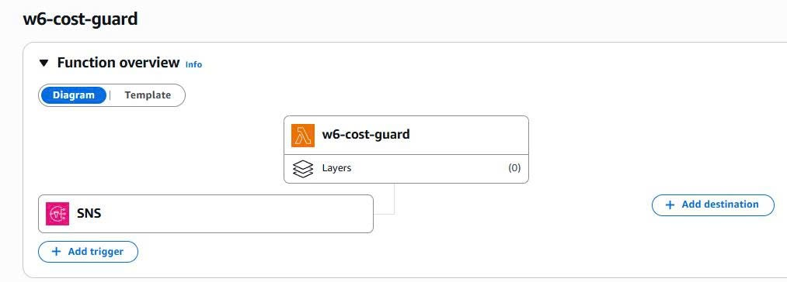

Code mẫu của Lambda:
```python
import boto3
import json
import logging

logger = logging.getLogger()
logger.setLevel(logging.INFO)

autoscaling = boto3.client("autoscaling")
rds         = boto3.client("rds")


# ─────────────────────────────────────────────
# Helper: kiểm tra tag keep=true
# ─────────────────────────────────────────────
def has_keep_tag(tags: list) -> bool:
    """Trả về True nếu resource có tag keep=true (không phân biệt hoa thường)."""
    for tag in tags or []:
        if tag.get("Key", "").lower() == "keep" and tag.get("Value", "").lower() == "true":
            return True
    return False


# ─────────────────────────────────────────────
# ASG: Scale về 0
# ─────────────────────────────────────────────
def scale_down_asg() -> list:
    """
    Lấy danh sách tất cả ASG, scale về MinSize=0, DesiredCapacity=0
    cho những ASG không có tag keep=true.

    Flow:
      Lambda scale ASG → 0
      → ASG tự terminate EC2 instances
      → CloudTrail ghi nhận TerminateInstances
      → Cost giảm thật sự ✅
    """
    scaled = []

    response = autoscaling.describe_auto_scaling_groups()

    for group in response.get("AutoScalingGroups", []):
        asg_name    = group["AutoScalingGroupName"]
        min_size    = group["MinSize"]
        desired     = group["DesiredCapacity"]
        tags        = group.get("Tags", [])

        # Chuyển tag format của ASG → cùng format với has_keep_tag
        asg_tags = [{"Key": t["Key"], "Value": t["Value"]} for t in tags]

        if has_keep_tag(asg_tags):
            logger.info(f"[ASG] SKIP {asg_name} — tag keep=true")
            continue

        if desired == 0 and min_size == 0:
            logger.info(f"[ASG] SKIP {asg_name} — already at 0")
            continue

        logger.info(
            f"[ASG] SCALING DOWN {asg_name} "
            f"(MinSize: {min_size}→0, Desired: {desired}→0)"
        )

        try:
            autoscaling.update_auto_scaling_group(
                AutoScalingGroupName=asg_name,
                MinSize=0,
                DesiredCapacity=0,
            )
            scaled.append({
                "asg_name":    asg_name,
                "prev_min":    min_size,
                "prev_desired": desired,
            })
            logger.info(f"[ASG] SCALED TO 0: {asg_name} ✅")
        except Exception as e:
            logger.error(f"[ASG] ERROR scaling {asg_name}: {e}")

    return scaled


# ─────────────────────────────────────────────
# DocumentDB (RDS): dừng DB instances không có keep=true
# ─────────────────────────────────────────────
def stop_documentdb_instances() -> list:
    """
    Dừng các máy chủ DocumentDB (hoặc RDS) instances đang available,
    không có tag keep=true.
    
    Lưu ý kỹ thuật: DocumentDB dùng chung API với RDS của boto3.
    """
    stopped = []

    paginator = rds.get_paginator("describe_db_instances")
    for page in paginator.paginate():
        for db in page.get("DBInstances", []):
            db_id     = db["DBInstanceIdentifier"]
            db_status = db["DBInstanceStatus"]
            db_arn    = db["DBInstanceArn"]

            if db_status != "available":
                logger.info(f"[DocumentDB-Instance] SKIP {db_id} — status={db_status}")
                continue

            tag_response = rds.list_tags_for_resource(ResourceName=db_arn)
            tags = tag_response.get("TagList", [])

            if has_keep_tag(tags):
                logger.info(f"[DocumentDB-Instance] SKIP {db_id} — tag keep=true")
                continue

            logger.info(f"[DocumentDB-Instance] STOPPING {db_id}")
            try:
                rds.stop_db_instance(DBInstanceIdentifier=db_id)
                stopped.append(db_id)
                logger.info(f"[DocumentDB-Instance] STOPPED {db_id} ✅")
            except Exception as e:
                logger.error(f"[DocumentDB-Instance] ERROR stopping {db_id}: {e}")

    return stopped


# ─────────────────────────────────────────────
# DocumentDB Clusters: bỏ qua clusters (vì DocumentDB không hỗ trợ stop cluster)
# ─────────────────────────────────────────────
def check_documentdb_clusters() -> list:
    """
    Kiểm tra DocumentDB (hoặc RDS) clusters.
    
    Lưu ý: AWS DocumentDB (engine=docdb) KHÔNG hỗ trợ API stop/start cấp độ Cluster.
    → Phải skip, nếu không sẽ lỗi InvalidParameterCombination.
    """
    stopped = []

    paginator = rds.get_paginator("describe_db_clusters")
    for page in paginator.paginate():
        for cluster in page.get("DBClusters", []):
            cluster_id     = cluster["DBClusterIdentifier"]
            cluster_status = cluster["Status"]
            cluster_arn    = cluster["DBClusterArn"]
            engine         = cluster.get("Engine", "")

            # ⚠️ DocumentDB cluster KHÔNG support stop — bỏ qua
            if engine == "docdb":
                logger.info(f"[DocumentDB-Cluster] SKIP {cluster_id} — DocumentDB cluster cannot be stopped")
                continue

            if cluster_status != "available":
                logger.info(f"[DB-Cluster] SKIP {cluster_id} — status={cluster_status}")
                continue

            tag_response = rds.list_tags_for_resource(ResourceName=cluster_arn)
            tags = tag_response.get("TagList", [])

            if has_keep_tag(tags):
                logger.info(f"[DB-Cluster] SKIP {cluster_id} — tag keep=true")
                continue

            logger.info(f"[DB-Cluster] STOPPING {cluster_id} (engine={engine})")
            try:
                rds.stop_db_cluster(DBClusterIdentifier=cluster_id)
                stopped.append(cluster_id)
                logger.info(f"[DB-Cluster] STOPPED {cluster_id} ✅")
            except Exception as e:
                logger.error(f"[DB-Cluster] ERROR stopping {cluster_id}: {e}")

    return stopped


# ─────────────────────────────────────────────
# Lambda Handler chính
# ─────────────────────────────────────────────
def lambda_handler(event, context):
    logger.info("=" * 60)
    logger.info("w6-cost-guard invoked")
    logger.info(f"Event: {json.dumps(event)}")
    logger.info("=" * 60)

    # Xác định nguồn kích hoạt
    source = "scheduled"
    if event.get("Records"):
        sns_msg = event["Records"][0].get("Sns", {}).get("Message", "")
        source  = "budgets-sns"
        logger.info(f"Triggered by SNS/Budgets: {sns_msg[:200]}")

    # ── Scale ASG về 0 (EC2 tự bị terminate) ──
    logger.info("--- Step 1: Scale down Auto Scaling Groups ---")
    scaled_asg = scale_down_asg()

    # ── Dừng DocumentDB instances ──────────────
    logger.info("--- Step 2: Stop DocumentDB Instances ---")
    stopped_db_instances = stop_documentdb_instances()

    # ── Dừng DocumentDB clusters ───────────────
    logger.info("--- Step 3: Check DocumentDB Clusters ---")
    stopped_clusters = check_documentdb_clusters()

    # ── Tổng kết ─────────────────────────────
    result = {
        "source":                 source,
        "scaled_asg":             scaled_asg,             # ASG đã scale về 0
        "stopped_db_instances":   stopped_db_instances,   # DocumentDB/RDS instances đã dừng
        "stopped_clusters":       stopped_clusters,       # Clusters đã dừng (thường là rỗng cho docdb)
        "total_actions":          len(scaled_asg) + len(stopped_db_instances) + len(stopped_clusters),
    }

    logger.info("=" * 60)
    logger.info(f"SUMMARY: {json.dumps(result, indent=2)}")
    logger.info("=" * 60)

    return {
        "statusCode": 200,
        "body": json.dumps(result),
    }

```

---

## Component (b) — EventBridge Scheduler (Daily Cron)


| Thuộc tính | Giá trị |
|-----------|---------|
| **Tên** | `w6-cost-guard-daily` |
| 📸 **Evidence — Lambda Execution Log**

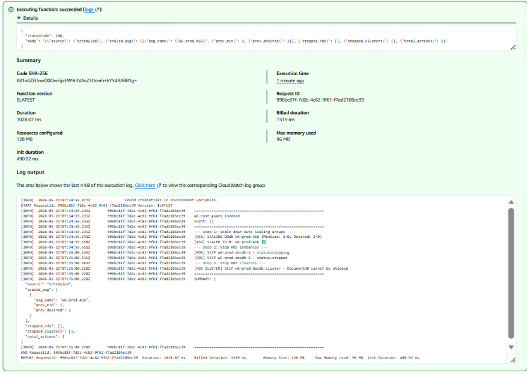

### Log thực tế đầy đủ (CloudWatch Logs):

```
[INFO] 2026-05-21T07:34:59.077Z    Found credentials in environment variables.

START RequestId: 996bc81f-7d2c-4c82-9f61-f7ad2105ec39 Version: $LATEST

[INFO] 2026-05-21T07:34:59.235Z  ============================================================
[INFO] 2026-05-21T07:34:59.235Z  w6-cost-guard invoked
[INFO] 2026-05-21T07:34:59.235Z  Event: {}
[INFO] 2026-05-21T07:34:59.235Z  ============================================================
[INFO] 2026-05-21T07:34:59.235Z  --- Step 1: Scale down Auto Scaling Groups ---
[INFO] 2026-05-21T07:34:59.541Z  [ASG] SCALING DOWN W6-prod-ASG (MinSize: 2→0, Desired: 2→0)
[INFO] 2026-05-21T07:34:59.650Z  [ASG] SCALED TO 0: W6-prod-ASG ✅
[INFO] 2026-05-21T07:34:59.651Z  --- Step 2: Stop RDS instances ---
[INFO] 2026-05-21T07:35:00.135Z  [RDS] SKIP w6-prod-docdb-1 — status=stopping
[INFO] 2026-05-21T07:35:00.136Z  [RDS] SKIP w6-prod-docdb-2 — status=stopped
[INFO] 2026-05-21T07:35:00.161Z  --- Step 3: Stop RDS clusters ---
[INFO] 2026-05-21T07:35:00.228Z  [RDS-CLUSTER] SKIP w6-prod-docdb-cluster — DocumentDB cannot be stopped
[INFO] 2026-05-21T07:35:00.228Z  ============================================================
[INFO] 2026-05-21T07:35:00.228Z  SUMMARY: {
  "source": "scheduled",
  "scaled_asg": [
    {
      "asg_name": "W6-prod-ASG",
      "prev_min": 2,
      "prev_desired": 2
    }
  ],
  "stopped_rds": [],
  "stopped_clusters": [],
  "total_actions": 1
}
[INFO] 2026-05-21T07:35:00.228Z  ============================================================

END RequestId: 996bc81f-7d2c-4c82-9f61-f7ad2105ec39
REPORT RequestId: 996bc81f-7d2c-4c82-9f61-f7ad2105ec39
  Duration:        1028.07 ms
  Billed Duration: 1519 ms
  Memory Size:     128 MB
  Max Memory Used: 96 MB
  Init Duration:   490.92 ms
```

---

### Phân tích chi tiết từng bước trong log:

**🔹 Khởi động Lambda (07:34:59.077Z → 07:34:59.235Z)**

```
Found credentials in environment variables.
START RequestId: 996bc81f-7d2c-4c82-9f61-f7ad2105ec39 Version: $LATEST
Event: {}
```

| Điểm | Giải thích |
|------|-----------|
| `Found credentials in environment variables` | Lambda sử dụng IAM Role được gắn — không hardcode credential trong code ✅ |
| `RequestId: 996bc81f-...` | ID duy nhất của lần invoke này — dùng để tìm trong CloudTrail |
| `Version: $LATEST` | Đang chạy phiên bản code mới nhất |
| `Event: {}` | Được kích hoạt bởi **EventBridge Scheduler** (payload rỗng `{}`) — không phải SNS trigger |
| **Init Duration: 490.92 ms** | Cold start — Lambda khởi tạo môi trường Python lần đầu. Các lần invoke sau sẽ nhanh hơn |

---

**🔹 Step 1 — Scale ASG về 0 (07:34:59.235Z → 07:34:59.650Z | mất ~415ms)**

```
[INFO] --- Step 1: Scale down Auto Scaling Groups ---
[INFO] [ASG] SCALING DOWN W6-prod-ASG (MinSize: 2→0, Desired: 2→0)    ← 07:34:59.541Z
[INFO] [ASG] SCALED TO 0: W6-prod-ASG ✅                               ← 07:34:59.650Z
```

| Dòng log | Thời điểm | Giải thích |
|----------|-----------|-----------|
| `SCALING DOWN W6-prod-ASG` | 07:34:59.541Z | Lambda gọi `autoscaling:DescribeAutoScalingGroups()` → tìm thấy `W6-prod-ASG` đang có `MinSize=2, Desired=2` → không có tag `keep=true` → tiến hành scale |
| `(MinSize: 2→0, Desired: 2→0)` | — | **Trạng thái trước:** ASG duy trì tối thiểu 2 EC2 instance. **Sau khi Lambda chạy:** MinSize=0, DesiredCapacity=0 → ASG sẽ tự terminate tất cả EC2 |
| `SCALED TO 0: W6-prod-ASG ✅` | 07:34:59.650Z | AWS xác nhận đã nhận lệnh `UpdateAutoScalingGroup`. ASG bắt đầu quá trình terminate EC2 instances |
| **Thời gian bước 1** | ~109ms | Từ khi gọi API đến khi nhận phản hồi — rất nhanh vì chỉ là update config ASG |

> **Lưu ý quan trọng:** Dòng `SCALED TO 0` không có nghĩa EC2 đã bị tắt ngay lập tức. AWS cần thêm ~1-3 phút để ASG drain connections và terminate instances. Evidence CloudTrail `TerminateInstances` sẽ xuất hiện sau khoảng này.

---

**🔹 Step 2 — Kiểm tra RDS instances (07:34:59.651Z → 07:35:00.136Z | mất ~485ms)**

```
[INFO] --- Step 2: Stop RDS instances ---
[INFO] [RDS] SKIP w6-prod-docdb-1 — status=stopping    ← 07:35:00.135Z
[INFO] [RDS] SKIP w6-prod-docdb-2 — status=stopped     ← 07:35:00.136Z
```

| Dòng log | Giải thích |
|----------|-----------|
| `SKIP w6-prod-docdb-1 — status=stopping` | Instance này đang trong trạng thái `stopping` — tức là đã bị dừng trước đó (có thể từ lần Lambda chạy trước). Lambda bỏ qua, không gọi lệnh stop lại để tránh lỗi |
| `SKIP w6-prod-docdb-2 — status=stopped` | Instance này đã ở trạng thái `stopped` hoàn toàn rồi. Lambda bỏ qua — không cần xử lý |
| **Không có `STOPPING` nào** | Tất cả RDS instances đã được dừng từ trước → Lambda hoạt động đúng: chỉ stop những gì đang chạy, không động vào những gì đã dừng |

> **Phân tích:** `stopped_rds: []` trong SUMMARY nghĩa là không có RDS instance nào mới bị dừng trong lần chạy này — vì tất cả đã được dừng rồi. Đây là behavior đúng, không phải lỗi.

---

**🔹 Step 3 — Kiểm tra RDS Clusters (07:35:00.161Z → 07:35:00.228Z | mất ~67ms)**

```
[INFO] --- Step 3: Stop RDS clusters ---
[INFO] [RDS-CLUSTER] SKIP w6-prod-docdb-cluster — DocumentDB cannot be stopped
```

| Dòng log | Giải thích |
|----------|-----------|
| `SKIP w6-prod-docdb-cluster — DocumentDB cannot be stopped` | Lambda phát hiện cluster này có `engine=docdb` (Amazon DocumentDB). AWS **không cho phép** gọi `stop_db_cluster` với DocumentDB — sẽ raise `InvalidParameterCombination`. Code đã xử lý đúng: skip thay vì crash |

> **Tại sao DocumentDB không stop được?** DocumentDB là fully-managed service, AWS quản lý vòng đời cluster theo cách khác với RDS. Cách tiết kiệm cost với DocumentDB là xóa cluster khi không dùng và restore từ snapshot — không phải stop/start như RDS.

---

**🔹 SUMMARY — Kết quả tổng hợp**

```json
{
  "source": "scheduled",
  "scaled_asg": [
    {
      "asg_name": "W6-prod-ASG",
      "prev_min": 2,
      "prev_desired": 2
    }
  ],
  "stopped_rds": [],
  "stopped_clusters": [],
  "total_actions": 1
}
```

| Field | Giá trị | Ý nghĩa |
|-------|---------|---------|
| `source` | `"scheduled"` | Được kích hoạt bởi EventBridge Scheduler (daily cron), không phải SNS/Budgets |
| `scaled_asg` | `[{W6-prod-ASG, prev_min:2, prev_desired:2}]` | **1 ASG đã bị scale về 0** — lưu lại state trước đó để audit |
| `stopped_rds` | `[]` | Không RDS instance nào mới bị dừng (đã dừng từ trước) |
| `stopped_clusters` | `[]` | Không cluster nào bị dừng (DocumentDB được skip đúng cách) |
| `total_actions` | `1` | **Tổng cộng 1 hành động thực tế** = 1 ASG scale down → dẫn đến 2 EC2 bị terminate |

---

**🔹 Thông số hiệu năng Lambda (REPORT line)**

| Chỉ số | Giá trị | Phân tích |
|--------|---------|----------|
| **Duration** | `1028.07 ms` | Tổng thời gian thực thi code (~1 giây) |
| **Billed Duration** | `1519 ms` | AWS tính tiền = Duration + Init Duration (cold start). Giá: $0.0000000021 × 1519ms × 128MB ≈ **$0.000000000407** — gần như **miễn phí** |
| **Memory Size** | `128 MB` | Cấu hình tối thiểu — phù hợp với workload boto3 API calls |
| **Max Memory Used** | `96 MB` | Chỉ dùng 75% bộ nhớ cấp phát — không bị OOM |
| **Init Duration** | `490.92 ms` | Cold start Python + boto3 import. Chỉ xảy ra lần đầu — các lần sau sẽ là ~100-200ms |

---

**🔹 Tại sao scale ASG thay vì stop EC2 trực tiếp?**

```
❌ Cách KHÔNG hiệu quả: stop EC2 trực tiếp
   ┌─────────────────────────────────────────┐
   │ Lambda → ec2:StopInstances(i-xxxx)      │
   │ → EC2 stopped (status: stopped)         │
   │ → ASG health check: UNHEALTHY ❌        │
   │ → ASG tự động launch EC2 mới!           │
   │ → Cost KHÔNG giảm — tốn thêm tiền ❌   │
   └─────────────────────────────────────────┘

✅ Cách ĐÚNG (implementation hiện tại): scale ASG về 0
   ┌─────────────────────────────────────────────────────┐
   │ Lambda → autoscaling:UpdateAutoScalingGroup(        │
   │            MinSize=0, DesiredCapacity=0)            │
   │ → ASG nhận lệnh: "không cần instance nào"          │
   │ → ASG tự drain connections                         │
   │ → ASG terminate tất cả EC2 instances               │
   │ → ASG KHÔNG launch instance mới (MinSize=0)        │
   │ → Cost giảm thật sự ✅                             │
   │ → CloudTrail: TerminateInstances event ✅           │
   └─────────────────────────────────────────────────────┘
```

---

## Component (c) — Budgets $70/$150 → SNS → Lambda (Cost-Driven Path)

### Cấu hình AWS Budgets:

| Alert | Ngưỡng | Loại | Hành động |
|-------|--------|------|-----------|
| **Alert 1** | $70 | ABSOLUTE_VALUE | SNS → Lambda dừng tài nguyên ngay |
| **Alert 2** | $150 | ABSOLUTE_VALUE | SNS → Lambda emergency stop (hard cap) |

### Wiring chain:
```
AWS Budgets ($70 hoặc $150 ACTUAL)
    ↓
SNS Topic: w6-cost-guard-topic
    ↓
Lambda Subscription (Protocol: lambda)
    ↓
w6-cost-guard invoked với event.Records[0].Sns
    ↓
scale_down_asg() + stop_rds_instances()
```

### Demo thủ công Budgets → SNS → Lambda chain:

```bash
# Publish test message vào SNS để demo chain (không cần đợi budget thật vượt)
aws sns publish \
  --topic-arn arn:aws:sns:ap-southeast-1:231086608626:w6-cost-guard-topic \
  --message "Budget threshold exceeded - MH-COST-A demo test" \
  --subject "[TEST] w6-cost-guard Budget Alert" \
  --region ap-southeast-1
```

_(Screenshot before/after: EC2 instances → terminated sau khi Lambda chạy)_

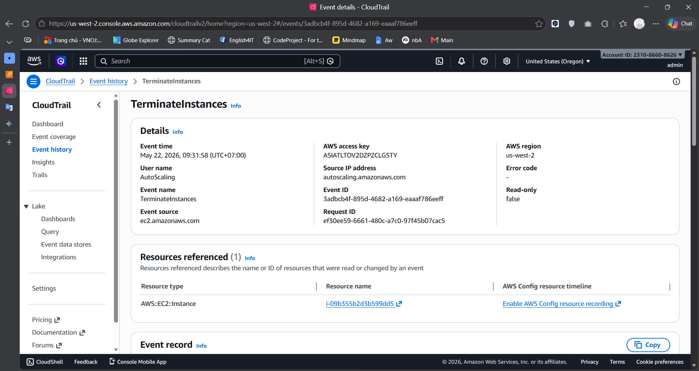

---

## ADR — Ghi chú về AWS Cost Data Latency
* **Context:** Hệ thống yêu cầu một cơ chế tự động ngắt tài nguyên compute khi tài khoản chạm ngưỡng ngân sách $150 thông qua chuỗi liên kết AWS Budgets -> SNS -> Lambda. Tuy nhiên, dữ liệu tính toán chi phí thực tế của AWS Billing luôn có độ trễ từ 8 đến 24 giờ để cập nhật đầy đủ từ hạ tầng lên hệ thống quản lý hóa đơn. Điều này dẫn đến việc một spike chi phí đột biến trong môi trường sandbox 48 giờ sẽ không thể kích hoạt trigger của AWS Budgets ngay lập tức tại thời điểm xảy ra vi phạm.
* **Decision:** Nhóm quyết định thiết kế kiến trúc phân tầng: Sử dụng EventBridge Scheduler chạy daily cron lúc 20:00 hằng ngày làm chốt chặn dọn dẹp tài nguyên cố định để đảm bảo không phát sinh chi phí qua đêm. Đồng thời, để chứng minh tính đúng đắn và khả năng vận hành của chuỗi kết nối Cost-driven (AWS Budgets -> SNS), nhóm thực hiện kiểm thử độc lập bằng cách giả lập xuất bản (Publish) một test message mang cấu trúc JSON chuẩn của AWS Budgets vào SNS Topic để kích hoạt Lambda tắt tài nguyên mục tiêu một cách trực quan trong buổi demo live.

**Quyết định kiến trúc (Architecture Decision Record):**

> AWS Budgets cập nhật dữ liệu chi phí với **độ trễ từ 8 đến 24 giờ**. Trong môi trường Lab 48 giờ, budget alert từ chi phí thực tế sẽ **không tự động kích hoạt** vì dữ liệu cost chưa được cập nhật kịp thời.
>
> **Giải pháp demo:** Sử dụng `aws sns publish` để gửi test message trực tiếp vào SNS topic — Lambda sẽ được kích hoạt và thực hiện dừng tài nguyên như trong production. Đây là cách demo hợp lệ và được chấp nhận theo yêu cầu W6.
>
> **Behavior trong production thực tế:** Khi AWS Budgets phát hiện chi phí vượt $70 (sau độ trễ 8-24h), SNS sẽ tự động kích hoạt Lambda — không cần can thiệp thủ công.

# MH-COST-V
## Component 1 - Tagging Discipline

Toàn bộ billable resource trong kiến trúc SSR của BuildForce đã được gắn 4 tag bắt buộc theo chuẩn nhất quán:

| Tag Key       | Giá trị                        |
| ------------- | ------------------------------ |
| `Owner`       | `pvkhanhtruong1810@gmail.com`  |
| `Environment` | `dev`                          |
| `CostCenter`  | `G15`                          |
| `Application` | `BuildForce`                   |

> AWS Cost Explorer phân biệt hoa/thường - `dev` ≠ `Dev`, `BuildForce` ≠ `buildforce`. Toàn bộ giá trị được enforce theo whitelist bên dưới.

---

**Bằng chứng - Tags trên DocumentDB Cluster**

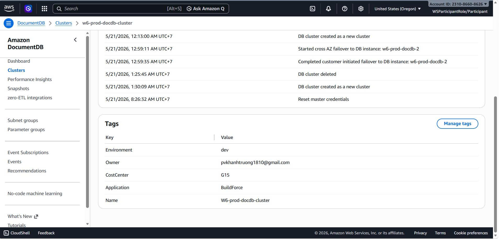

DocumentDB là database layer chính của BuildForce, lưu trữ user data, job listing và matching data. Tag `Application=BuildForce` đảm bảo toàn bộ chi phí database được quy về đúng workload trong Cost Explorer.

---

**Bằng chứng - Tags trên S3 Bucket**

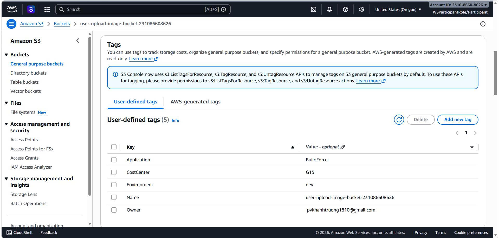

S3 bucket dùng để lưu ảnh profile, CV upload và static images. Nếu không tag, chi phí storage sẽ nằm trong "Untagged" của account và không thể filter theo workload.

---

## Tagging Strategy Document (1 trang)

**MH-COST-V · Component 1 · W6 Evidence**

### Thông Tin Dự Án

| Trường              | Giá trị                                                 |
| ------------------- | ------------------------------------------------------- |
| **Tên ứng dụng**    | BuildForce                                              |
| **Group ID**        | G15                                                     |
| **Team Lead**       | pvkhanhtruong1810@gmail.com                             |
| **Business domain** | Nền tảng tuyển dụng và matching nhân lực ngành xây dựng |

### Mục Đích

Tài liệu này định nghĩa chiến lược tag AWS cho toàn bộ billable resource của dự án **BuildForce**. Mục tiêu:

- Quy được từng đô la chi phí về đúng workload, môi trường, và người chịu trách nhiệm.
- Làm nền tảng cho Cost Explorer filter, AWS Budgets alert, và automated cost guard (MH-COST-A).
- Enforce nhất quán để tránh split cost do typo hoặc case mismatch.

#### Bốn Tag Key Bắt Buộc

| Tag Key       | Giá trị cố định cho dự án này | Quy tắc                                                                                             |
| ------------- | ----------------------------- | --------------------------------------------------------------------------------------------------- |
| `Owner`       | `pvkhanhtruong1810@gmail.com` | Chữ thường toàn bộ. Không dùng `owner`, `OWNER`. Một người duy nhất chịu trách nhiệm mỗi resource. |
| `Environment` | `dev`                         | Chữ thường toàn bộ. Không dùng `Dev`, `DEV`, `development`.                                         |
| `CostCenter`  | `G15`                         | Viết hoa chữ G, số nguyên theo sau. Không dùng `g15`, `group15`.                                    |
| `Application` | `BuildForce`                  | PascalCase, cố định. Không dùng `buildforce`, `Buildforce`, `build-force`.                          |

> **Nguyên tắc vàng:** AWS Cost Explorer phân biệt hoa/thường. `dev` và `Dev` là hai giá trị khác nhau - chúng sẽ tạo ra hai dòng riêng biệt trong Cost Explorer và phá vỡ filter theo tag.

### Phạm Vi Áp Dụng - Kiến Trúc SSR W6

Dựa trên kiến trúc SSR đã redeploy, tag bắt buộc trên **mọi** resource thuộc các loại sau:

| Resource Type                    | Tên resource trong BuildForce stack         | Ghi chú                                    |
| -------------------------------- | ------------------------------------------- | ------------------------------------------ |
| **AWS Amplify App**              | BuildForce Amplify App                      | Gắn tag cho ứng dụng Amplify chính         |
| **EC2 Instances**                | Các instance trong Auto Scaling Group (ASG) | Tag từng instance, không chỉ ASG           |
| **DocumentDB Cluster**           | BuildForce DocumentDB Cluster               | Tag cả cluster lẫn từng instance bên trong |
| **DocumentDB Instances**         | Các instance trong cluster                  | Tag riêng từng instance                    |
| **ElastiCache**                  | ElastiCache nodes (caching layer)           | Tag từng node                              |
| **S3 Buckets**                   | Bucket chứa ảnh / static assets             | Tag từng bucket riêng biệt                 |
| **CloudFront Distribution**      | CDN phân phối frontend                      | Tag distribution                           |
| **WAF Web ACL**                  | WAF bảo vệ Amplify / CloudFront             | Tag Web ACL                                |
| **EBS Volumes**                  | Volume gắn với EC2 trong ASG                | Propagate từ EC2 nếu có thể                |
| **CloudWatch Log Groups**        | Application logs                            | Tag log group                              |
| **EventBridge Rules/Schedulers** | Scheduled jobs, cost guard trigger          | Tag rule/scheduler                         |
| **SNS Topics**                   | Alert và automation trigger                 | Tag topic                                  |
| **Lambda Functions**             | Cost guard, automation                      | Tag function                               |

### Giá Trị Được Phép - Whitelist

| Tag Key       | Giá trị hợp lệ                | Không được phép                                 |
| ------------- | ----------------------------- | ----------------------------------------------- |
| `Owner`       | `pvkhanhtruong1810@gmail.com` | `admin`, `team`, `N/A`, để trống, viết hoa      |
| `Environment` | `dev`, `staging`, `prod`      | `Dev`, `DEV`, `development`, `test`, `uat`      |
| `CostCenter`  | `G15`                         | `g15`, `group15`, `Group 15`, `15`              |
| `Application` | `BuildForce`                  | `buildforce`, `Buildforce`, `build-force`, `BF` |

### Enforcement - Cách Đảm Bảo Compliance

**Trong Account Workshop (Ngắn Hạn - Ưu Tiên)**

Bước 1 - Audit toàn bộ resource bằng Tag Editor:
- AWS Console → **Resource Groups & Tag Editor** → **Tag Editor**
- Region: chọn region đang dùng → Resource types: All supported → Search → xem resource nào thiếu tag `Application`

Bước 2 - Audit EC2 bằng CLI:

```bash
aws ec2 describe-instances \
  --query "Reservations[*].Instances[*].{ID:InstanceId,State:State.Name,Tags:Tags}" \
  --output table
```

Bước 3 - Activate Cost Allocation Tags (bắt buộc - bước riêng):
- Vào **AWS Billing console** → **Cost allocation tags**
- Tìm key `Owner` và `Application` → **Activate**
- ⚠️ Tag chỉ xuất hiện như filter dimension trong Cost Explorer **sau khi** được activate tại đây.

**Checklist trước demo Thứ Sáu:**

- [x] Amplify App có đủ 4 tag
- [x] Ít nhất 1 EC2 instance có đủ 4 tag
- [x] DocumentDB cluster có đủ 4 tag
- [x] ElastiCache node có đủ 4 tag
- [x] S3 bucket(s) có đủ 4 tag
- [x] CloudFront distribution có đủ 4 tag
- [x] WAF Web ACL có đủ 4 tag
- [x] `Owner` và `Application` đã được activate trong Billing console
- [x] Screenshot đủ ≥3 loại resource khác nhau đã có tag

**Nếu Chuyển Sang IaC (Dài Hạn)**

CloudFormation stack-level tags:

```yaml
Tags:
  - Key: Owner
    Value: pvkhanhtruong1810@gmail.com
  - Key: Environment
    Value: dev
  - Key: CostCenter
    Value: G15
  - Key: Application
    Value: BuildForce
```

Terraform default_tags:

```hcl
provider "aws" {
  region = "ap-southeast-1"
  default_tags {
    tags = {
      Owner       = "pvkhanhtruong1810@gmail.com"
      Environment = "dev"
      CostCenter  = "G15"
      Application = "BuildForce"
    }
  }
}
```

### Liên Kết Với Các MH Khác

| MH                        | Phụ thuộc vào tagging                                                                                                 |
| ------------------------- | --------------------------------------------------------------------------------------------------------------------- |
| **MH-COST-V Component 2** | `Owner` và `Application` phải được activate trong Billing console                                                     |
| **MH-COST-V Component 3** | Cost Explorer filter theo `Application=BuildForce` để xem baseline cost breakdown                                     |
| **MH-COST-A**             | Lambda cost guard dùng tag `Environment=dev` để xác định resource cần stop; resource cần giữ lại thêm tag `keep=true` |
| **MH-OBS**                | CloudWatch namespace `RAG-Agent/RAG-Operations` align với tag `Application=BuildForce`                                   |
| **MH-SEC**                | Lambda security guard kiểm tra S3 bucket và Security Group thuộc `Application=BuildForce`                             |

---

## Component 2 - Cost Allocation Tags

Account workshop hiện không cấp quyền truy cập AWS Billing console - thao tác activate cost allocation tags bị từ chối (`AccessDenied`). Đây là giới hạn của sandbox account, không phải thiếu sót trong quy trình.

Trong một production account thật, bước này được thực hiện tại **Billing console → Cost allocation tags → Activate** cho key `Owner` và `Application`. Khi được activate, các key này xuất hiện như filter dimension trong Cost Explorer, cho phép filter chi phí theo `Application=BuildForce` thay vì chỉ xem tổng account.

---

## Component 3 - Cost Monitoring Tool

**AWS Budgets** đã được cấu hình để theo dõi và cảnh báo chi tiêu:

| Thuộc tính   | Giá trị                                         |
| ------------ | ----------------------------------------------- |
| Budget name  | `BuildForce-W6-Daily`                           |
| Period       | Daily                                           |
| Hard cap     | $140                                            |
| Alert 1      | 35.71% ($50) - cảnh báo sớm                     |
| Alert 2      | 92.86% ($130) - chạm trần                       |
| Notification | Email `pvkhanhtruong1810@gmail.com` + SNS topic |

Budget này cũng là trigger cho MH-COST-A: khi chạm ngưỡng, Budgets → SNS → Lambda tự động stop resource.

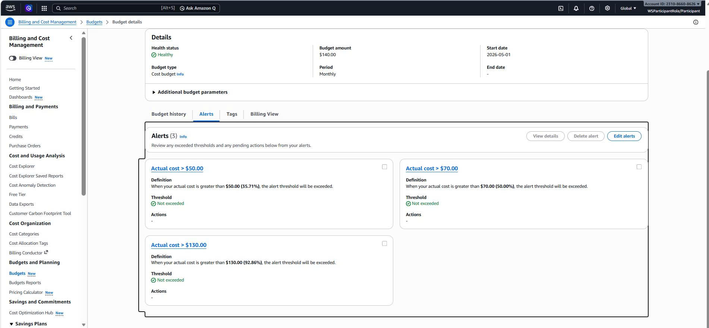
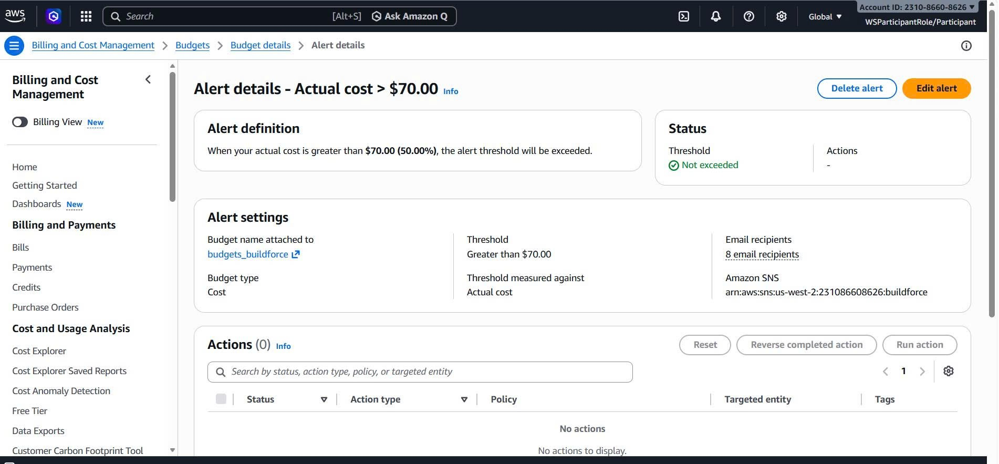
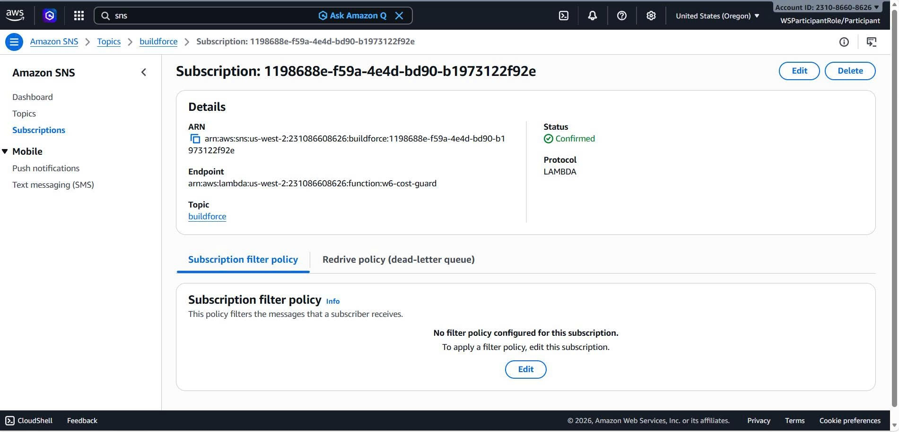

---
Khi budget lớn hơn 70$, trigger hàm lambda `w6-cost-guard` được thiết lập trong topic SNS để stop các instance trong hạ tầng

---


# MH-OBS

## Dashboard

_Hình 1: Dashboard bao gồm Custom Metric_
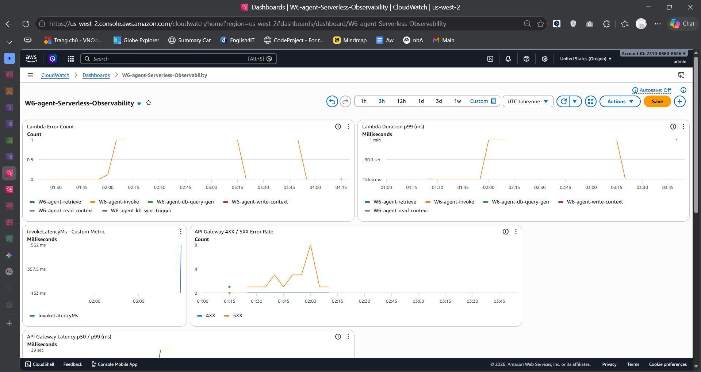

- **Widget 1: InvokeLatencyMs**: Biểu thị độ trễ của Lambda function gọi LLM (`W6-agent-invoke`) trong mỗi 30s, được biểu thị bằng đơn vị Milliseconds (ms). Đây là **Custom Metric** được trích xuất và đẩy lên trực tiếp từ tầng ứng dụng thông qua API `PutMetricData` nhằm kiểm soát thời gian phản hồi thực tế từ mô hình Claude 3.5.

- **Widget 2: Lambda Error Count**: Biểu thị số lượng lỗi phát sinh (Count) của các hàm Lambda xử lý trong kiến trúc (`W6-agent-retrieve`, `W6-agent-invoke`, `W6-agent-db-query-gen`, `W6-agent-write-context`, `W6-agent-read-context`, `W6-agent-kb-sync-trigger`). Đây là **Standard Metric** giúp phát hiện sớm các sự cố sụt gãy logic hoặc nghẽn kết nối mạng nội bộ.

- **Widget 3: Lambda Duration p99 (ms)**: Biểu thị thời gian xử lý của các hàm Lambda ở mốc phân vị thứ 99 (p99). Chỉ số tiêu chuẩn này giúp cô lập và phát hiện các trường hợp bị ảnh hưởng nghiêm trọng bởi hiện tượng khởi động nguội (Cold Start) hoặc nghẽn thắt nút cổ chai khi kết nối với EFS nội bộ.

- **Widget 4: API Gateway 4XX / 5XX Error Rate**: Biểu thị số lượng các mã lỗi HTTP đầu 4XX (Lỗi phía Client/Throttling/Vượt ngưỡng giới hạn) và đầu 5XX (Lỗi hệ thống/Timeout cấu hình phía Server) trả về từ API Gateway. Chỉ số này giúp đo lường trực diện mức độ ổn định dịch vụ cung cấp tới người dùng cuối.

_Hình 2: Code Custom Metric_
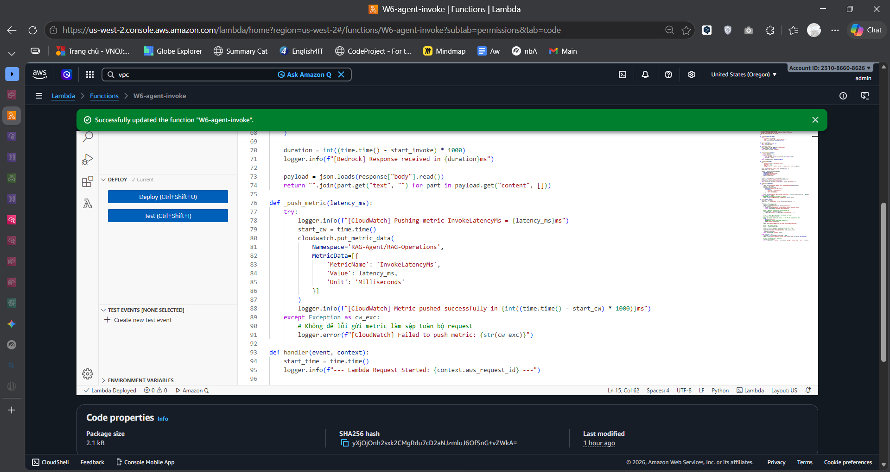
---
```python
def _push_metric(latency_ms):
    try:
        logger.info(f"[CloudWatch] Pushing metric InvokeLatencyMs = {latency_ms}ms")
        start_cw = time.time()
        cloudwatch.put_metric_data(
            Namespace='RAG-Agent/RAG-Operations',
            MetricData=[{
                'MetricName': 'InvokeLatencyMs',
                'Value': latency_ms,
                'Unit': 'Milliseconds'
            }]
        )
        logger.info(f"[CloudWatch] Metric pushed successfully in {int((time.time() - start_cw) * 1000)}ms")
    except Exception as cw_exc:
        # Không để lỗi gửi metric làm sập toàn bộ request
        logger.error(f"[CloudWatch] Failed to push metric: {str(cw_exc)}")
```
## Alarm

- Alarn này đếm số lần lỗi khi check health của ALB và gửi thông báo về email *pvkhantruong1810@gmail.com* khi số lần lớn hơn 1 trong vòng 1 phút

_Hình 3: Alarm_
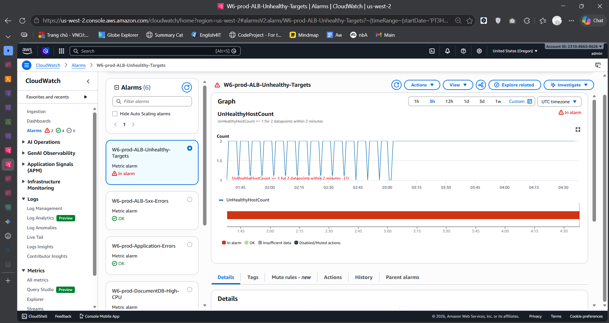

_Hình 4: Alarm Action_
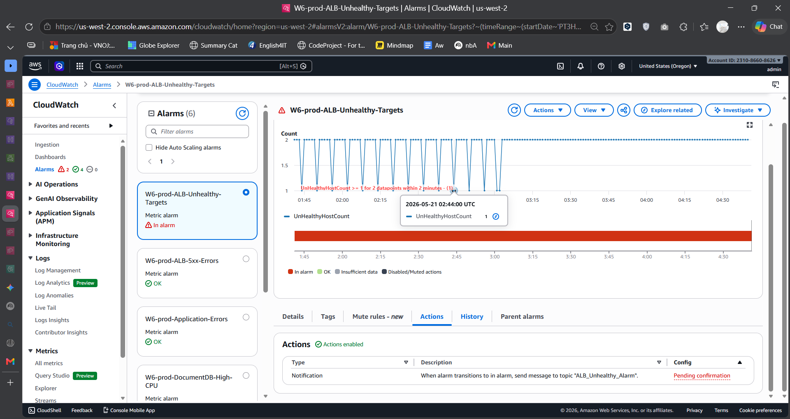

_Hình 5: SNS Email Confirmed_
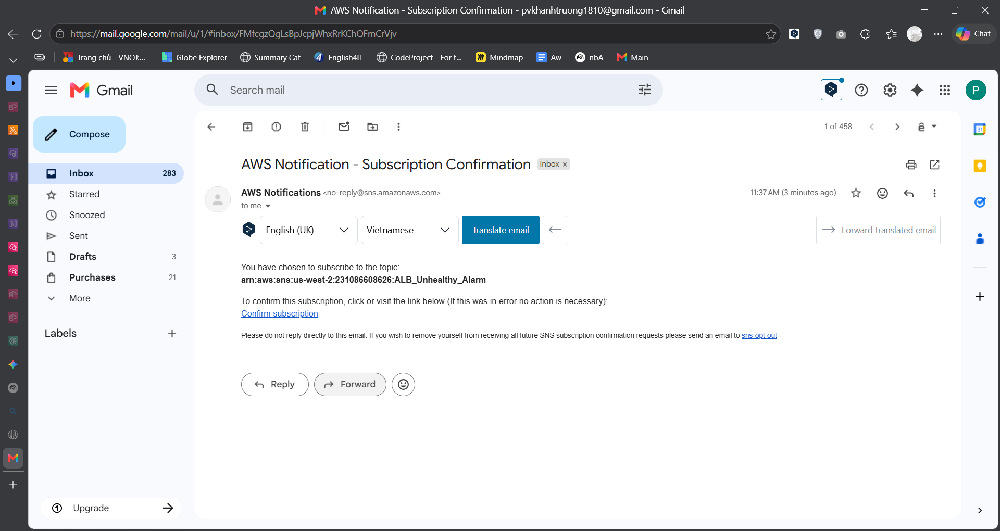

*Hình 6: SNS Email Received*
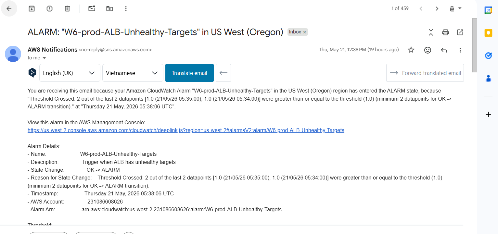


## Log Insights

Đây là query lọc ra các dòng log có tiền tố [Failure] để tổng hợp số lượng và các nguyên nhân gây ra lỗi khi gọi Invoke Lambda và dưới đây là kết quả mẫu.

```sql
fields @timestamp, @message
| filter @message like /\[Failure\]/
| parse @message "[Failure] Exception occurred after *ms: *" as execution_time, error_detail
| stats count(*) as total_failures by error_detail, bin(5m)
| sort total_failures desc
```

_Hình 6: Log Insights - Failure Log_
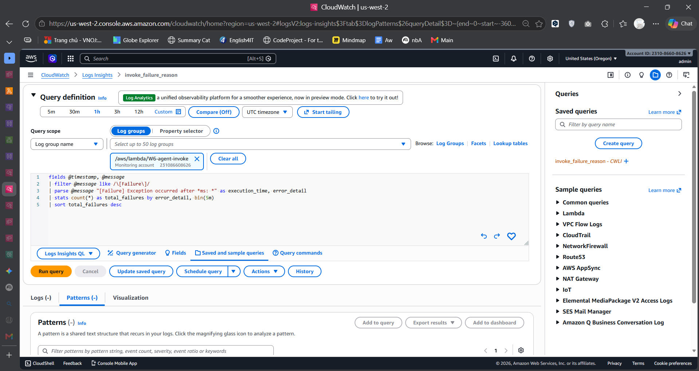
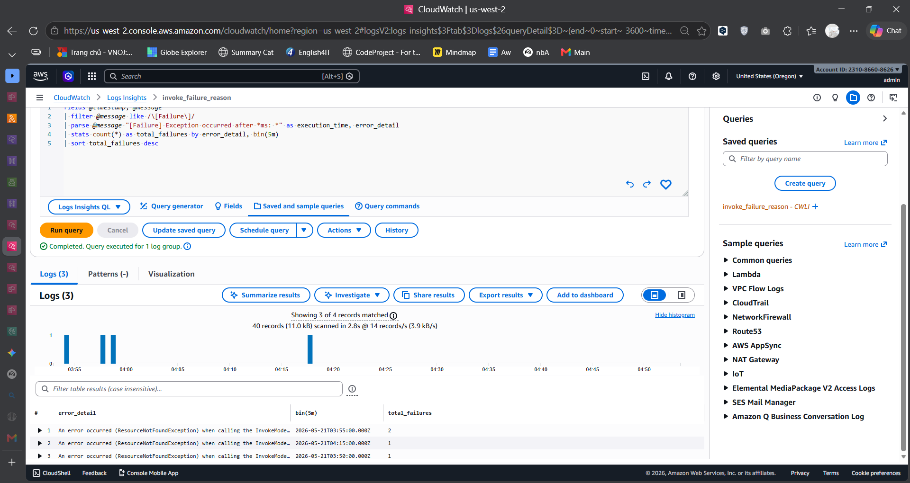

# MH-SEC

## Mục tiêu

Mục tiêu của MH-SEC là xây dựng cơ chế tự động phát hiện và xử lý Security Group nguy hiểm trên AWS. Trong bài này, nhóm triển khai cơ chế tự động xóa rule mở SSH public:

```text id="6y4i5n"
22 → 0.0.0.0/0
```

Rule này có thể khiến EC2 bị brute-force hoặc truy cập trái phép từ internet.

---

## Kiến trúc triển khai

Flow hoạt động:

```text id="o3wtvl"
User mở SSH public
↓
CloudTrail ghi log
↓
EventBridge detect event
↓
Trigger Lambda
↓
Lambda tự revoke rule
```

Các service sử dụng:

* AWS CloudTrail
* Amazon EventBridge
* AWS Lambda
* EC2 Security Group
* CloudWatch Logs

---

## IAM Least Privilege

Nhóm tạo IAM Policy và IAM Role riêng cho Lambda remediation để đảm bảo nguyên tắc least privilege.

### IAM Policy

```text id="qm5vtx"
MHSEC-Remediation-Policy
```

Permission chính:

```json id="5f1vdq"
ec2:DescribeSecurityGroups
ec2:RevokeSecurityGroupIngress
logs:CreateLogGroup
logs:CreateLogStream
logs:PutLogEvents
```

### IAM Role

```text id="w1xv06"
MHSEC-Lambda-Role
```

Ảnh evidence:


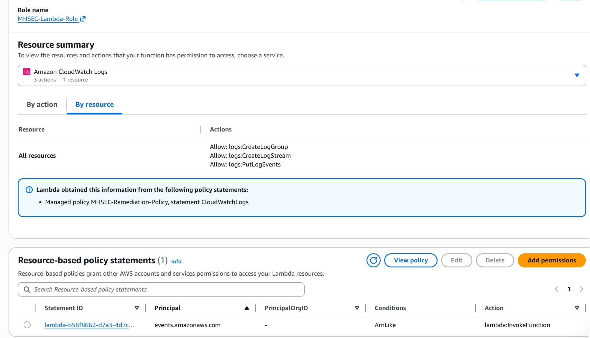


---

## Lambda Remediation

Lambda được tạo với tên:

```text id="jlwm9t"
mh-sec-remediation
```

Runtime:

```text id="xpv9r9"
Python 3.12
```

Handler:

```text id="j4s0mn"
lambda_function.lambda_handler
```

Ảnh Lambda configuration:

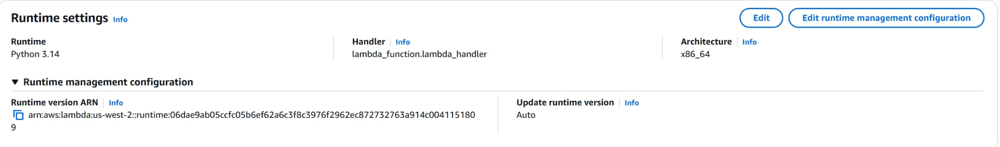


Lambda sẽ kiểm tra nếu inbound rule có:

```text id="9yc0go"
Port 22 + 0.0.0.0/0
```

thì tự động gọi:

```text id="t9xtvj"
RevokeSecurityGroupIngress
```

để xóa rule nguy hiểm.

Ảnh Lambda function:

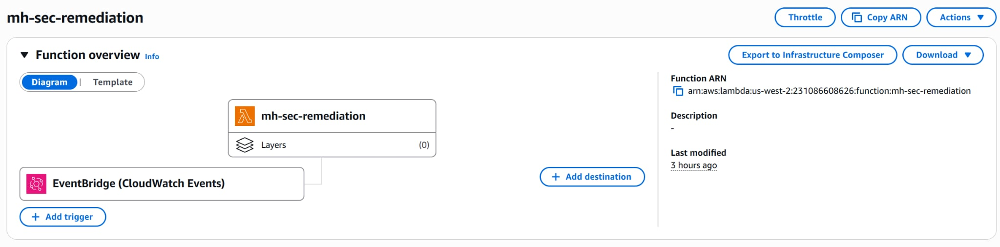

Dưới đây là code của Lambda:

```python
import boto3
import json

ec2 = boto3.client('ec2')

def lambda_handler(event, context):
  print(json.dumps(event))

  try:
    detail = event['detail']
    group_id = detail['requestParameters']['groupId']
    permissions = detail['requestParameters']['ipPermissions']['items']

    for perm in permissions:
      from_port = perm.get('fromPort')
      ip_ranges = perm.get('ipRanges', {}).get('items', [])

      for ip in ip_ranges:
        cidr = ip.get('cidrIp')

        if from_port == 22 and cidr == '0.0.0.0/0':
          print(f"Dangerous SSH rule detected in {group_id}")

          ec2.revoke_security_group_ingress(
            GroupId=group_id,
            IpPermissions=[
              {
                'IpProtocol': perm['ipProtocol'],
                'FromPort': 22,
                'ToPort': 22,
                'IpRanges': [
                  {
                    'CidrIp': '0.0.0.0/0'
                  }
                ]
              }
            ]
          )

          print("Dangerous rule revoked")

    return {
      'statusCode': 200,
      'body': 'Done'
    }

  except Exception as e:
    print(str(e))
    raise e
```

---

## EventBridge Rule

Rule EventBridge:

```text id="rgnv2d"
mh-sec-auto-remediation
```

Event pattern:

```json id="w1p2f8"
{
  "source": ["aws.ec2"],
  "detail-type": ["AWS API Call via CloudTrail"],
  "detail": {
    "eventSource": ["ec2.amazonaws.com"],
    "eventName": ["AuthorizeSecurityGroupIngress"]
  }
}
```

Rule này sẽ detect khi có thay đổi inbound Security Group.

Ảnh EventBridge trigger:

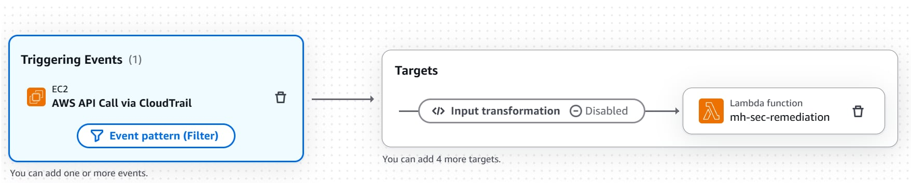

---

## Demo Remediation

Security Group test:

### w6-prod-03-sg-AppServerSecurityGroup-2Cfg9z5qd5VG

Nhóm thêm rule:

| Type | Port | Source    |
| ---- | ---- | --------- |
| SSH  | 22   | 0.0.0.0/0 |

Ảnh BEFORE remediation:

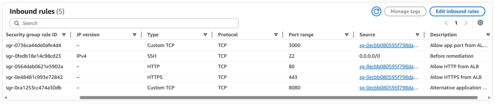

Sau vài giây:

* EventBridge trigger Lambda
* Lambda tự xóa rule
* Security Group quay về trạng thái an toàn

Ảnh AFTER remediation:

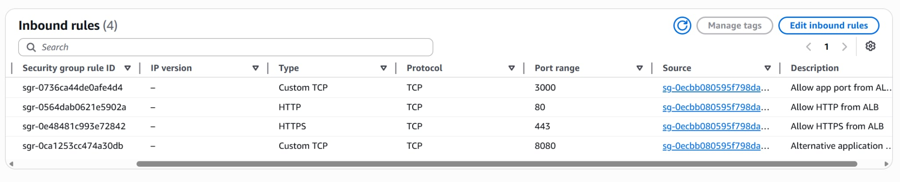

---

## CloudTrail Evidence

CloudTrail ghi nhận event:

```text id="te3y5r"
RevokeSecurityGroupIngress
```

Điều này chứng minh hệ thống đã tự động remediation thành công.

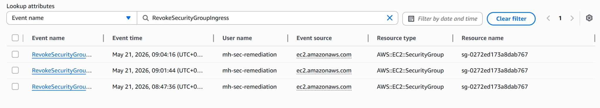

## Supporting Preventive Control

Nhóm của chúng tôi đã triển khai tính năng **Amazon S3 Block Public Access** ở cấp tài khoản như một biện pháp kiểm soát an ninh mang tính phòng ngừa cho bài tập AWS W6 MH-SEC. Rào chắn bảo vệ (guardrail) ở cấp tài khoản này kích hoạt cả bốn thiết lập của S3 Block Public Access trên toàn bộ tài khoản AWS, tạo ra một đường cơ sở an ninh (security baseline) nhằm chặn quyền truy cập công khai được cấp qua các ACL mới hoặc hiện có, chính sách bucket (bucket policies), chính sách điểm truy cập (access point policies), hoặc các cấu hình bucket công khai.

---

### Rủi ro chính được giải quyết

Rủi ro cốt lõi mà biện pháp kiểm soát này xử lý là **sự cố rò rỉ dữ liệu công khai ngoài ý muốn** của các bucket và đối tượng (objects) trên S3.

* **Khi không có rào chắn này:** Những sai sót trong cấu hình của con người—chẳng hạn như áp dụng các ACL hoặc chính sách bucket quá lỏng lẻo—có thể vô tình phơi nhiễm dữ liệu nhạy cảm ra Internet.
* **Khi áp dụng biện pháp:** Việc bắt buộc thực thi S3 Block Public Access ở cấp tài khoản sẽ giảm thiểu khả năng các cấu hình sai ở từng bucket đơn lẻ trở thành các sự cố an ninh có thể bị khai thác.

---

### Đánh giá Đánh đổi giữa An ninh và Chi phí (Security-Cost Tradeoff)

Sự đánh đổi này là **hoàn toàn hợp lý và có thể chấp nhận được** vì:

* **Chi phí trực tiếp:** Biện pháp kiểm soát này không làm phát sinh thêm chi phí dịch vụ AWS trực tiếp, trong khi lại giảm thiểu đáng kể xác suất xảy ra lộ lọt dữ liệu.
* **Chi phí vận hành:** Hệ quả vận hành chính là sự giảm bớt tính linh hoạt đối với các khối lượng công việc (workloads) thực sự có nhu cầu truy cập S3 công khai một cách có chủ đích. Tuy nhiên, hạn chế này lại hỗ trợ xây dựng một trạng thái an ninh mặc định mạnh mẽ hơn và hoàn toàn nhất quán với **nguyên tắc đặc quyền tối thiểu (least-privilege principles)**.

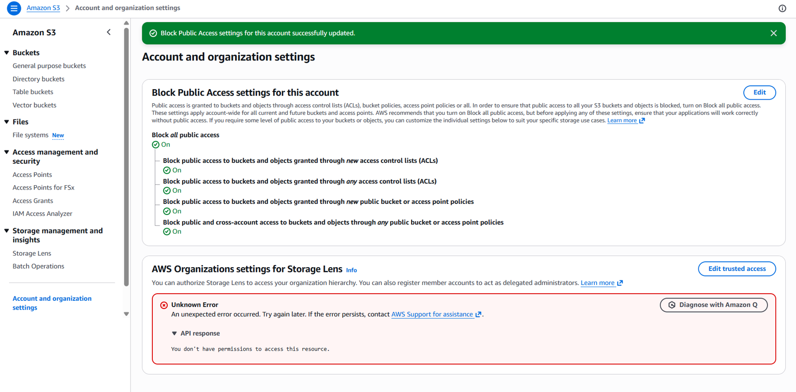

---

### Bucket Deny Policy

Bên cạnh việc bật **S3 Block Public Access** ở cấp tài khoản, nhóm cũng áp dụng một bucket policy phòng ngừa để từ chối các thao tác `PutObject` không đáp ứng yêu cầu bảo mật. Chính sách này đảm bảo rằng dữ liệu được tải lên bucket phải sử dụng kết nối TLS, tránh trường hợp object được truyền qua kênh không mã hóa.

Ví dụ bucket policy sử dụng điều kiện `aws:SecureTransport=false`:

```json
{
  "Version": "2012-10-17",
  "Statement": [
    {
      "Sid": "DenyInsecureTransport",
      "Effect": "Deny",
      "Principal": "*",
      "Action": "s3:PutObject",
      "Resource": "arn:aws:s3:::<bucket-name>/*",
      "Condition": {
        "Bool": {
          "aws:SecureTransport": "false"
        }
      }
    }
  ]
}
```

Chính sách này hoạt động như một lớp phòng ngừa bổ sung: ngay cả khi một principal có quyền `PutObject`, request vẫn bị từ chối nếu không đi qua HTTPS/TLS.


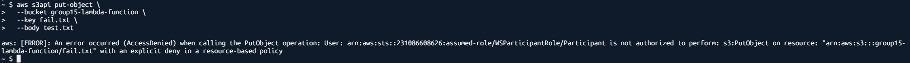

---

### Lý do không chọn hai phương án preventive control còn lại

Nhóm chọn **Path B — Account-level S3 Block Public Access + deny policy** vì phương án này phù hợp trực tiếp với rủi ro chính của bài MH-SEC: ngăn bucket S3 bị public ngoài ý muốn và chứng minh được bằng một test call bị từ chối. Đây cũng là phương án có chi phí trực tiếp bằng 0, dễ kiểm chứng trong tài khoản workshop 48 giờ, và liên kết rõ với Self-Healing Security Guard đang xử lý lỗi cấu hình public S3 bằng `PutPublicAccessBlock`.

**Không chọn Path A — KMS Customer Managed Key trên data store** vì CMK có chi phí duy trì theo tháng và cần thêm bằng chứng CloudTrail như `kms:GenerateDataKey` hoặc `kms:Decrypt` từ data store đang hoạt động. Với phạm vi W6, nhóm ưu tiên kiểm soát rủi ro public exposure của S3 trước, vì đây là lỗi cấu hình có thể tạo blast radius ngay lập tức nếu bucket chứa dữ liệu ứng dụng bị mở ra Internet. KMS CMK phù hợp hơn khi hệ thống đi vào production và cần audit trail chi tiết cho từng thao tác mã hóa/giải mã dữ liệu.

**Không chọn Path C — IAM Access Analyzer** vì phương án này thiên về phát hiện và triage external-access finding hơn là một preventive control trực tiếp chặn hành vi sai cấu hình. Trong tài khoản workshop ngắn hạn, việc tạo finding có ý nghĩa, phân tích intended/unintended access và viết remediation production sẽ khó chứng minh tác động vận hành rõ bằng việc bật S3 Block Public Access ở cấp tài khoản kèm deny policy. Do đó nhóm chọn Path B để có bằng chứng phòng ngừa cụ thể, dễ demo và nhất quán với guardrail tự động sửa lỗi public S3.


# Project Recap

**BuildForce** là một nền tảng công nghệ toàn diện phục vụ thị trường nhân sự, hỗ trợ người lao động tìm kiếm việc làm và giúp doanh nghiệp đăng tin tuyển dụng tối ưu. Để vận hành một hệ thống có tải trọng biến động lớn và tích hợp các tính năng thông minh, nhóm đã thiết kế và triển khai kiến trúc 3 lớp (3-Tier Architecture) chuẩn hóa trên AWS từ Tuần 1 đến Tuần 5. Tầng giao diện và điều hướng sử dụng Application Load Balancer (ALB) để phân phối lưu lượng truy cập một cách cân bằng và an toàn. Tầng xử lý logic (Compute Layer) được cấu hình nằm hoàn toàn trong Private Subnet và quản lý bởi một **Auto Scaling Group (ASG)**; quyết định kiến trúc này nhằm đảm bảo hệ thống có khả năng tự động co giãn linh hoạt theo lượng người dùng truy cập tìm việc theo các khung giờ cao điểm, đồng thời tối ưu hóa chi phí vận hành bằng cách thu hẹp tài nguyên khi thấp tải. 

Bên cạnh đó, hệ thống sở hữu tầng dữ liệu linh hoạt dựa trên **Amazon DocumentDB** để lưu trữ các hồ sơ ứng viên (CV) và tin tuyển dụng có cấu trúc dạng tài liệu phi định hình. Trọng tâm công nghệ của BuildForce là tầng AI thông minh (Knowledge Layer) tích hợp **Amazon Bedrock (Claude 3.5 Sonnet)** giúp phân tích sâu yêu cầu công việc, tự động chấm điểm độ phù hợp của ứng viên và tối ưu hóa trải nghiệm tìm kiếm việc làm bằng AI. Toàn bộ các quyết định kiến trúc kiên cố từ các tuần trước — từ phân tách Network an toàn, lưu trữ dữ liệu phi cấu trúc đến tích hợp tác vụ AI — chính là nền tảng cốt lõi để nhóm thực hiện các chiến lược giám sát (Observability), tự động chữa lành bảo mật (Self-Healing) và kiểm soát chi phí tối ưu (Cost Guard) trong tuần Operational Hardening này.

## Diagram Tham khảo
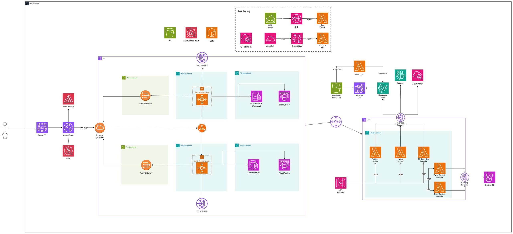
